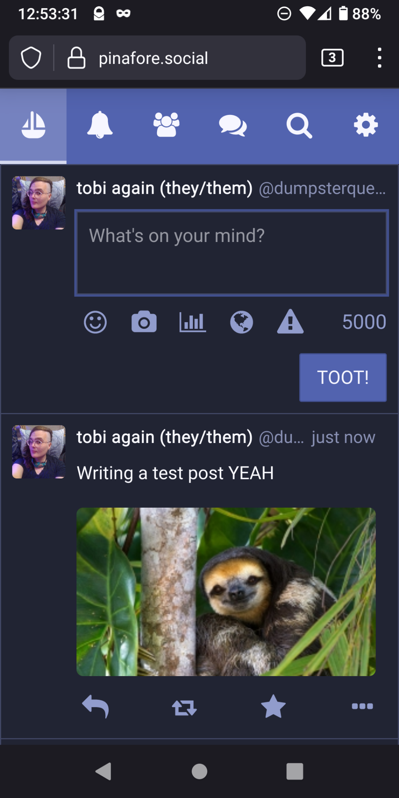

# GoToSocial

 

GoToSocial is an [ActivityPub](https://activitypub.rocks/) social network server, written in Golang.

  

GoToSocial provides a lightweight, customizable, and safety-focused entryway into the [Fediverse](https://en.wikipedia.org/wiki/Fediverse), and is comparable to (but distinct from) existing projects such as [Mastodon](https://joinmastodon.org/), [Pleroma](https://pleroma.social/), [Friendica](https://friendica.net), and [PixelFed](https://pixelfed.org/).

With GoToSocial, you can keep in touch with your friends, post, read, and share images and articles, without being tracked or advertised to.

## Features

### Federation

Because GoToSocial uses the [ActivityPub](https://activitypub.rocks/) protocol, you can Keep in touch not only with people on your home server, but with people all over the [Fediverse](https://en.wikipedia.org/wiki/Fediverse), seamlessly!

### Mastodon App Compatible

Full support for modern, elegant apps like [Tusky](https://tusky.app/) and [Pinafore](https://pinafore.social/).

Tusky                                                        |  Pinafore
:-----------------------------------------------------------:|:------------------------------------------------------------------:
  | 

### Customizable

#### Granular post settings

You should be able to choose how you want things you post to be interacted with:

* Local-only posts.
* Rebloggable/boostable toggle.
* 'Likeable' toggle.
* 'Replyable' toggle.

#### Easy customizability for admins

* Adjustable post length.
* Media upload size settings.

### Convenient

#### LetsEncrypt

 Built-in, automatic support for secure HTTPS with [LetsEncrypt](https://letsencrypt.org/).

#### Light footprint and good performance

Plays nice with lower-powered machines like Raspberry Pi, old laptops and tiny VPSes.

#### Easy to deploy

No external dependencies apart from a database. Just download the binary + assets (or Docker container), and run.

### Secure

#### HTTP signature authentication

Protect your data.

#### User Safety

Strict privacy enforcement for posts and strict blocking logic.

#### Subscribeable and shareable allow/denylists for federation

Import and export allowlists and denylists. Subscribe to community-created blocklists (think Adblocker, but for federation!).

#### Various federation modes

* 'Normal' federation; discover new servers.
* Allowlist-only federation; choose which servers you talk to.
* Zero federation; keep your server private.

### Wishlist

These cool things will be implemented if time allows (because we really want them):

* **Groups** and group posting!
* Reputation-based 'slow' federation.
* User-selectable custom templates for rendering public posts:
  * Twitter-style
  * Blogpost
  * Gallery
  * Etc.

## Design Ethos

One of the key differences between GoToSocial and other federated server projects is that GoToSocial doesn't include an integrated client front-end (ie., a webapp).

Instead, like the Matrix.org's [Synapse](https://github.com/matrix-org/synapse) project, it provides only a server implementation, some static pages, and a well-documented API. On top of this API, developers are free to build any front-end implementation or mobile application that they wish.

Because the server implementation is as generic and flexible/configurable as possible, GoToSocial provides the basis for many different types of social media experience, whether Tumblr-like, Facebook-like, or Twitter-like.

## Status

Work began on the project around February 2021, and the project is still in prerelease.

At this point, GoToSocial is already deployable and very useable, and it federates cleanly with other Fediverse servers.

For a detailed view on what's implemented and what's not, and progress made towards a first v0.1.0 (beta) release, see [here](./PROGRESS.md).

## Getting Started

Proper documentation for running and maintaining GoToSocial will be forthcoming in the first release.

For now (if you want to run it pre-alpha, like a beast), check out the [quick and dirty getting started guide](./GETTINGSTARTED.md).

## Contact

For questions and comments, you can reach out to tobi on the Fediverse [here](https://ondergrond.org/@dumpsterqueer), mail [admin@gotosocial.org](mailto:admin@gotosocial.org), or [join our Matrix channel](https://matrix.to/#/!gotosocial:ondergrond.org).

For bugs and feature requests, please check to see if there's [already an issue](https://github.com/superseriousbusiness/gotosocial/issues), and if not, open one or use one of the above channels to make a request (if you don't have a Github account).

## Credits

The following libraries and frameworks are used by GoToSocial, with gratitude 💕

* [buckket/go-blurhash](https://github.com/buckket/go-blurhash); used for generating image blurhashes.
* [gin-gonic/gin](https://github.com/gin-gonic/gin); speedy router engine.
  * [gin-contrib/cors](https://github.com/gin-contrib/cors); Gin CORS middleware.
  * [gin-contrib/sessions](https://github.com/gin-contrib/sessions); Gin sessions middleware.
  * [gin-contrib/static](https://github.com/gin-contrib/static); Gin static page middleware.
* [go-fed/activity](https://github.com/go-fed/activity); Golang ActivityPub/ActivityStreams library.
* [go-fed/httpsig](https://github.com/go-fed/httpsig); secure HTTP signature library.
* [go-pg/pg](https://github.com/go-pg/pg); Postgres ORM library.
* [google/uuid](https://github.com/google/uuid); UUID generation.
* [gorilla/websocket](https://github.com/gorilla/websocket); Websocket connectivity.
* [h2non/filetype](https://github.com/h2non/filetype); filetype checking.
* [oklog/ulid](https://github.com/oklog/ulid); sequential, database-friendly ID generation.
* [sirupsen/logrus](https://github.com/sirupsen/logrus); logging.
* [stretchr/testify](https://github.com/stretchr/testify); test framework.
* [superseriousbusiness/exifremove](https://github.com/superseriousbusiness/exifremove) forked from [scottleedavis/go-exif-remove](https://github.com/scottleedavis/go-exif-remove); EXIF data removal.
* [superseriousbusiness/oauth2](https://github.com/superseriousbusiness/oauth2) forked from [go-oauth2/oauth2](https://github.com/go-oauth2/oauth2); oauth server framework and token handling.
* [urfave/cli](https://github.com/urfave/cli); command-line interface framework.
* [wagslane/go-password-validator](https://github.com/wagslane/go-password-validator); password strength validation.

## Sponsorship + Funding

Currently, this project is funded using Liberapay, to put bread on the table while work continues on it.

If you want to sponsor this project, you can do so [here](https://liberapay.com/dumpsterqueer/)! `<3`

### Image Attribution

Logo made by [Freepik](https://www.freepik.com) from [www.flaticon.com](https://www.flaticon.com/).

### License

GoToSocial is licensed under the [GNU AGPL v3](LICENSE).
