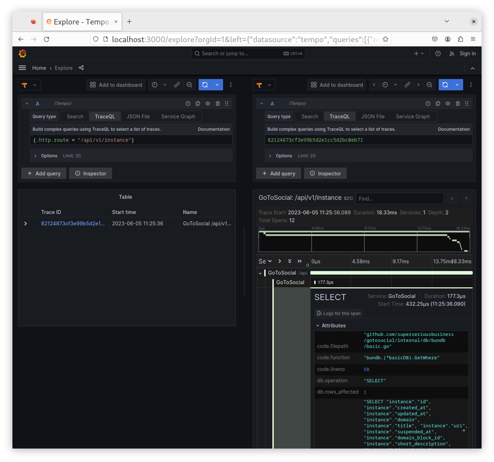

# Tracing

GoToSocial comes with [OpenTelemetry][otel] based tracing built-in. It's not wired through every function, but our HTTP handlers and database library will create spans. How to configure tracing is explained in the [Observability configuration reference][obs].

In order to receive the traces, you need something to ingest them and then visualise them. There are many options available including self-hosted and commercial options.

We provide an example of how to do this using [Grafana Tempo][tempo] to ingest the spans and [Grafana][grafana] to explore them. Please beware that the configuration we provide is not suitable for a production setup. It can be used safely for local development and can provide a good starting point for setting up your own tracing infrastructure.

You'll need the files in [`example/tracing`][ext]. Once you have those you can run `docker-compose up -d` to get Tempo and Grafana running. With both services running, you can add the following to your GoToSocial configuration and restart your instance:

```yaml
tracing-enabled: true
tracing-transport: "grpc"
tracing-endpoint: "localhost:4317"
tracing-insecure: true
```

[otel]: https://opentelemetry.io/
[obs]: ../../configuration/observability/
[tempo]: https://grafana.com/oss/tempo/
[grafana]: https://grafana.com/oss/grafana/
[ext]: https://github.com/superseriousbusiness/gotosocial/tree/main/example/tracing

## Querying and visualising traces

Once you execute a few queries against your instance, you'll be able to find them in Grafana. You can use the Explore tab and pick Tempo as the datasource. Because our example configuration for Grafana enables [TraceQL][traceql], the Explore tab will have the TraceQL query type selected by default. You can switch to "Search" instead and find all traces emitted by GoToSocial under the "GoToSocial" service name.

Using TraceQL, a simple TraceQL query to find all traces related to requests to `/api/v1/instance` would look like this:

```
{.http.route = "/api/v1/instance"}
```

If you wanted to see all GoToSocial traces, you could instead run:

```
{.service.name = "GoToSocial"}
```

Once you select a trace, a second panel will open up visualising the span. You can drill down from there, by clicking into every sub-span to see what it was doing.



[traceql]: https://grafana.com/docs/tempo/latest/traceql/
