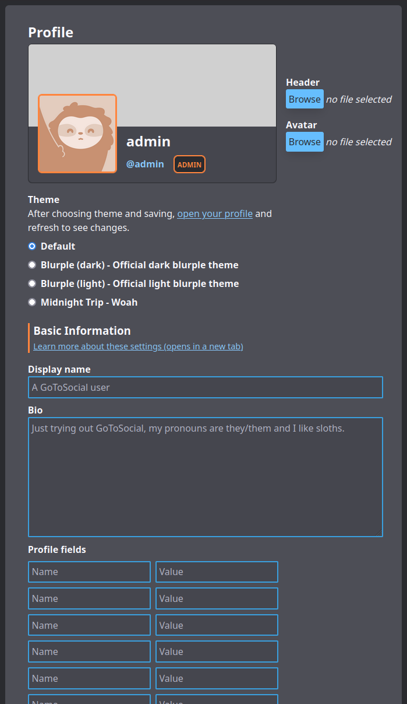
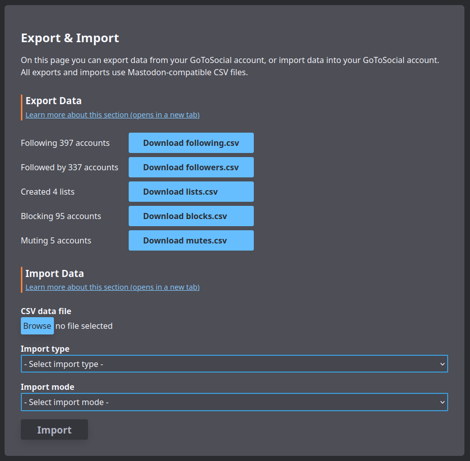

# 设置

GoToSocial 提供了一个设置界面，你可以在这里更新你的贴文和账户设置，添加头像和横幅背景图，为你的账户撰写简介等。

你可以通过访问自己 GoToSocial 实例的 `https://my-instance.example.com/settings` 来访问设置。设置面板同样使用 OAuth 机制进行身份验证。

在提供实例 URL 后，你会看到提示，要求你使用电子邮件地址和密码登录。

## 账户

在账户部分，你可以更改昵称、头像和横幅背景图。你还可以选择启用手动批准关注请求，并选择提供公开的贴文 RSS 源。

### 设置头像/横幅背景图

要设置头像或横幅背景图，请在相应部分点击 `浏览` 按钮，并使用文件浏览器选择图像。

当前支持的图像格式有 `gif`、`png`、`webp` 和 `jpeg`/`jpg`。

页面底部会显示图像在你的账户中的预览。如果你对选择满意，点击页面底部的 `保存账户信息` 按钮。

如果你转到自己的账户页并刷新页面，页面将会显示新的头像/横幅背景图。这个更新可能需要一些时间才能传播到其他外站实例。

### 选择主题

GoToSocial 提供主题供你选择，以更改账户的外观和氛围。

要选择主题，只需在账户设置页面中选择，然后点击页面底部的 `保存账户信息`。用浏览器查看账户页（可能需要刷新页面），你会看到新主题已被应用，访问你账户的其他人也会看到。

!!! tip "添加更多主题"
    实例管理员可以通过将 CSS 文件放入 `web/assets/themes` 文件夹中来添加更多主题。有关详细信息，请参阅管理员文档中的[主题](../admin/themes.md)部分。

### 基本信息

#### 昵称

昵称是与你的用户名一起显示在账户上的简短标识。

尽管创建后无法更改用户名，但昵称可以更改。

昵称可以包含空格、大写字母、表情符号等。

这是放网名或全名的好地方。例如，如果你的用户名是 `@miranda`，昵称可以是 `Miranda Priestly`。

#### 简介

你的简介是介绍你的账户和自己的较长文本。适合用于：

- 提示你贴文的内容。
- 提及大致年龄/位置。
- 链接到你的其他账户或账户。
- 说明与他人互动时的边界和偏好。
- 链接你经常使用的标签。

简介支持 `纯文本` 或 `markdown` 格式。默认贴文格式设置如[贴文设置](#贴文设置)中所述。

#### 资料字段

资料字段是一系列名称/值对，将显示在账户上，并传播到其他外站实例。

此处适合放置的信息包括：

- 你的网站链接
- 众筹/捐助页面的链接
- 你的年龄
- 人称代词

一些示例：

- 别名：汉德尔·沃尔特
- 我的网站：https://example.org
- 年龄：99
- 代词：she/her/她
- 我的其他账户：@someone@somewhere.com

### 可见性和隐私

#### 个人资料上显示的贴文可见性级别

使用此下拉菜单，你可以选择在你的网页版账户页、贴文以及 RSS 源（如果你已启用 RSS）上显示的贴文可见性级别。

**默认情况下，GoToSocial 仅在网页版账户页上显示公开可见的贴文，而不显示不列出的贴文。** 你可以调整此设置，以显示不列出的贴文，这类似于其他 ActivityPub 软件如 Mastodon 的默认设置。

你还可以选择在 GoToSocial 的网页视图上完全不显示任何贴文。这样，你可以安心发表贴文，而无需担心有人通过网页浏览你的个人资料并查看你的贴文。

此设置仅适用于你自己的贴文的可见性。其他用户的“不列出”贴文永远不会显示。

此设置不会影响你的贴文在 ActivityPub 协议和客户端中的可见性，因此即便你选择不在网页版账户页显示任何贴文，只要他人是你的粉丝、你的贴文被转发到他们的时间线，或使用链接搜索你的某个贴文，他们仍然可以看到的贴文。

!!! warning
    请注意，此设置的更改也会应用于之前的贴文。
    
    也就是说，如果你之前发布了一条“不列出”可见性的贴文，而当时你的网页版账户页被设置为仅显示公开贴文，此时如果你更改此设置为一并显示公开和不列出，那你之前发布的“不列出”贴文将会与公开贴文一起显示在你的网页版账户页上。
    
    同样地，如果你选择不显示任何贴文，那么所有贴文将从你的网页版账户页中隐藏，无论它们是在何时创建，也无论当时此选项被设置为什么。这种情况将持续直到你再次更改此设置。

!!! tip
    结合（域名）屏蔽，如果有人通过公开贴文骚扰你，这是一种很好的“紧急”设置。虽然它不会阻止在 ActivityPub 客户端中可以看到你的贴文的人，但至少会防止他们无需身份验证就通过浏览器点击查看你的贴文，并通过 URL 轻松与他人分享。

#### 手动批准关注请求（即锁定帐户）

此复选框允许你决定是否希望手动审核账户的关注请求。

当此选项**未勾选**时，新关注请求会被自动批准，无需你的干预。对于更面向公众的账户或不怎么发布敏感信息的情况而言，这很有用。

当其**已勾选**时，你必须手动批准新关注请求，并可以拒绝你不想被关注的账号的关注请求。这对仅向粉丝发布私人内容的私人账户很有用。

在联邦宇宙中，一般将此选项称为“锁定”账户。

勾选或取消勾选复选框后，务必点击底部的 `保存账户信息` 按钮以保存新设置。

#### 将账户标记为可被搜索引擎和目录发现

此设置用于更新账户上的“可发现”标记。

选中账户的可发现性框可执行以下操作：

- 更新账户的 robots 元信息标记，允许其被搜索引擎索引并出现在搜索引擎结果中。
- 向外站指示账户可包含在公共目录和索引中。

将可发现性标记打开可能需要一周或更长时间才会生效，账户不会立即出现在搜索引擎结果中。

!!! tip
    为了避免暴露给爬虫，新帐户的可发现性默认为 false。但对于希望被抓取的面向公众的帐户，将其设置为 true 是有用的。

!!! info
    可发现性设置是关于**账户的可发现性**，而不是贴文的可被搜索性。这与 Mastodon 实例或其他使用全文搜索的实例的贴文索引无关！

#### 启用公开贴文的 RSS 源

用户的 RSS 源默认情况下是禁用的，但可以通过此复选框选择。有关更多信息，请参阅 [RSS](./rss.md)。

此源仅包括设置为“公开”的贴文（参见 [隐私设置](./posts.md#隐私设置)）。

!!! warning
    公开您的 RSS 源允许*任何人*匿名订阅您公开贴文的更新，绕过关注和关注请求。

#### 隐藏你关注/被关注的人

默认情况下，GoToSocial 会在你的公开网络资料上显示你的关注/粉丝数量，并允许其他人查看你关注的和关注你的人。这对于账户发现可能很有用。然而，出于隐私和安全原因，你可能希望隐藏这些信息，并隐藏其他账户的关注/粉丝清单。你可以通过勾选此框来做到这一点。

勾选此框后，你的关注/粉丝数量将从你的公开网络资料中隐藏，其他人将无法浏览你的关注/粉丝清单。

### 高级

#### 自定义 CSS

如果实例管理员允许，自定义 CSS 可以让你进一步自定义账户在浏览器中的外观。

如果此设置未被实例管理员启用，文本输入框将为只读状态，自定义 CSS 将不会应用。

请参阅 [自定义 CSS](./custom_css.md) 页面，了解有关为账户编写自定义 CSS 的一些提示。

!!! tip
    你在此框中添加的任何自定义 CSS 都将在*选择主题之后*应用，因此你可以选择一个喜欢的预设主题，然后进行自己的调整！

## 贴文

### 贴文设置

默认贴文语言设置允许你向其他用户声明你的贴文通常使用哪种语言。这对说其它语言（例如韩语）并希望过滤掉其他语言的贴文的用户很有帮助。

默认贴文可见性设置允许你设置新贴文的默认可见性。当你通常发布公开或只对粉丝可见的贴文，但不想每次发贴时都设置隐私时会很有用。请记住，这只是默认设置：无论你在此处设置什么，仍然可以根据需要单独设置新贴文的隐私。有关贴文隐私设置的更多信息，请参阅[贴文页面](./posts.md)。

默认贴文格式设置允许你选择在解析贴文时使用哪个文本解释器。

plain（默认）设置提供标准贴文格式，类似于许多其他联邦宇宙服务端使用的格式。这非常适合一般目的的发布：你可以写简短的推特风格的贴文，或多段文章，插入链接，并使用用户名提及其他账户。

markdown 设置表示你的贴文应被按 Markdown 格式解析，这是一种标记语言，提供更多选项来自定义贴文的布局和外观。有关 plain 和 markdown 贴文格式之间差异的更多信息，请参阅 [贴文页面](posts.md)。

更新贴文设置后，请记得点击该部分底部的 `保存设置` 按钮以保存更改。

### 默认互动规则

通过此部分，你可以为新贴文设置每个可见级别的默认互动规则。这允许你精确控制他人如何与你的贴文互动。

这使你能够做以下事情：

- 创建只有你自己可以互动的贴文。
- 创建仅粉丝/你关注的人可以互动的贴文。
- 创建任何人都可以点赞或转发，但只有特定人可以回复的贴文。
- 等等。

例如，下图显示了一个公开可见性贴文的默认互动规则，允许任何人点赞或转发，但仅允许粉丝和你关注的人回复。

请记住，互动规则不具备前向可追溯性。应用默认互动规则之后创建的贴文将默认使用新设置的规则，但在此之前创建的任何贴文将使用创建时的默认规则。

无论在贴文上设置了什么规则，首先被考虑的仍是可见性设置和账户屏蔽情况。例如，如果你将某种类型的互动范围设置为“任何人”，这仍然会排除你屏蔽的账户，或你实例屏蔽的域名域下的账户。“任何人”在这种情况下基本上意味着“任何通常能看到贴文的人”。

最后，请注意，无论为贴文设置了什么规则，贴文中提到的任何账户将**始终**能够回复该贴文。

更新互动规则设置后，请记得点击该部分底部的 `保存规则` 按钮以保存更改。

如果你想将所有规则重置为初始默认值，可以点击 `重置为默认值` 按钮。

!!! danger
    虽然 GoToSocial 尊重互动规则，但不能保证其他服务端软件也会这样做，即使你的实例禁止某些互动，其他服务器上的账户可能仍会向其粉丝发送（被禁止的）贴文回复和转发。
    
    随着更多 ActivityPub 服务端推出互动规则支持，这个问题有望减少，但在此期间，GoToSocial 只能在“尽力而为”范围内进行尝试，以根据你设定的规则限制与贴文的互动。

## 电子邮箱和密码

### 更改电子邮箱

你可以使用面板的更改电子邮箱部分更改账户的电子邮箱地址。出于安全原因，你必须提供当前密码以验证更改。

输入新电子邮箱地址，并点击“更改电子邮箱地址”后，必须打开新电子邮件地址的收件箱，并通过提供的链接确认地址。完成后，你的电子邮箱地址更改将被确认。

!!! info
    如果你的实例使用 OIDC 作为授权/身份提供商，你可以通过设置面板更改电子邮箱地址，但只会影响 GoToSocial 用于联系你的电子邮箱地址，而不会更改用于登录账户的电子邮箱地址。要更改此项，应联系你的 OIDC 提供商。

### 更改密码

你可以使用面板的更改密码部分为账户设置新密码。出于安全原因，你必须提供当前密码以验证更改。

!!! info
    如果你的实例使用 OIDC 作为授权/身份提供商，你将无法通过 GoToSocial 设置面板更改密码，此时应联系你的 OIDC 提供商。

有关 GoToSocial 如何管理密码的更多信息，请参阅[密码管理文档](./password_management.md)。

## 迁移

在迁移部分，你可以管理与与账户别名、迁移到其他账户或从其他账户迁移相关的设置。

有关移动账户的更多信息，请参阅[迁移文档](./migration.md)。

## 导出和导入

在导出和导入部分，你可以从 GoToSocial 账户导出数据或将数据导入账户。

### 导出

要导出你的关注、粉丝、账户列表、账户屏蔽列表或账户静音列表，你可以使用此页面上的按钮。

所有导出都将以 Mastodon 导出格式兼容的 CSV 格式提供，因此如果有需要，可以将其导入 Mastodon 或另一个 GoToSocial 实例。

### 导入

你可以使用导入部分，将其他账户的数据导入到 GoToSocial 账户中，使用从其他账户导出的 CSV 文件。

这在你已将账户[迁移](./migration.md)到 GoToSocial 账户，并希望保留在以前的账户上的关注列表和屏蔽列表时很有用。

要将数据导入账户，首先点击“浏览”并选择从 Mastodon 或其他兼容实例导出的与 Mastodon 导出格式兼容的 CSV 文件。

然后，使用下拉菜单选择通过 CSV 文件上传的数据类型。

!!! warning
    在选择“类型”时要小心，否则可能会意外封禁你计划关注的一堆账户，反之亦然！

然后，选择是要**合并**新数据到 GoToSocial 账户中该类型的现有数据，还是要用 CSV 文件中包含的数据**覆盖**现有数据。

如果选择**合并**，则 CSV 文件中包含的任何数据都将添加到现有数据中，而不会删除任何现有数据。

例如，如果你的 GoToSocial 账户关注 `account1` 和 `account2`，并且正在上传一个包含 `account3` 和 `account4` 的关注 CSV 文件，并使用模式 **合并**，那么在导入结束时，你将关注 `account1`、`account2`、`account3` 和 `account4`。

如果选择**覆盖**，则 CSV 文件中包含的任何数据将*替换*现有数据，删除 CSV 文件中未包含的条目。

例如，如果你的 GoToSocial 账户关注 `account1` 和 `account2`，并上传一个包含 `account3` 和 `account4` 的关注 CSV 文件，并使用模式 **覆盖**，那么导入结束时，你将关注 `account3` 和 `account4`。你对 `account1` 和 `account2` 的关注将被移除。

合并和覆盖操作都是幂等的，这通常意味着现有数据和 CSV 文件中的重复条目不会产生问题，如果需要重试导入，可以多次导入相同的数据。

!!! info
    由于各种原因，通过导入不可能一定会重新创建上传的 CSV 文件中的每个条目。例如，假设你试图导入包含 `example_account` 的关注 CSV，但 `example_account` 的实例已下线，或者它们的实例封禁了你的实例，或你的实例封禁了它们的实例等。在这种情况下，将无法创建对 `example_account` 的关注。
